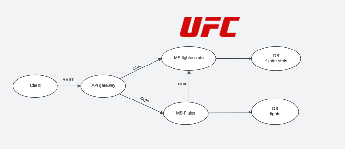

# ufc_microservices
UFC database mangament backend using a microservices architecture. Microservices communicate with an API gateway via GRPC. The API Gateway exposes a REST API which clients can access. 


## Dependencies
```sh
pip install flask grpcio grpcio-tools 
``` 
## How to run
Run the **generate_proto.bat** to generate python's proto files. then
run the 2 microservices (**fight_ms.py** and **fighter_stat_ms.py**) and the API gateway in parallel. running them for the first will automaticaly create the sqlite databases.
```sh
.\generate_proto.bat
python .\gateway.py
python .\fight_ms.py
python .\fighter_stat_ms.py
```
## How to use
`GET` **/fights** - gets all fights in the database.

`GET` **/fight/{name}** - gets all the fights which {name} fought. 

`POST`: **/fight** - adds a new fight, this will also send requests to the fighter stats microservice to update the 2 figthers' stats.

`DELETE`: **/fight/{id}** - deletes a fight, also affects figther stats.

`GET`: **/fighter/{name}** - gets {name}'s stats.

`GET`: **/fighters** - gets a lists of all the fighters.

## Authors
- Ammar Halloul
- Hatem Kilani
